# Wavii Wearable - Aplicación de bioinstrumentación y tecnologías biomédicas

## Resumen

El objetivo de este proyecto fue desarrollar un wearable orientado a la medición de la calidad del sueño. Un wearable de este tipo debe ser capaz de recopilar datos biomédicos precisos, transmitirlos de manera segura a la nube y permitir su análisis por profesionales de la salud a distancia. Este enfoque tiene el potencial de mejorar significativamente la capacidad de diagnóstico y tratamiento de los trastornos del sueño.
---
### Desarrolladores
JMLV, CJTS, DAGM

## Presentación del Proyecto

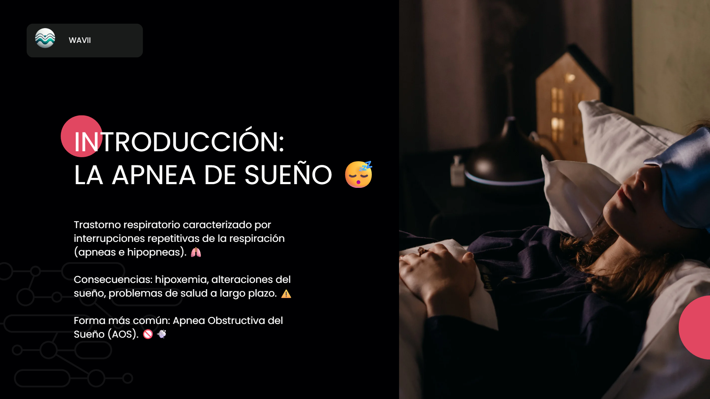
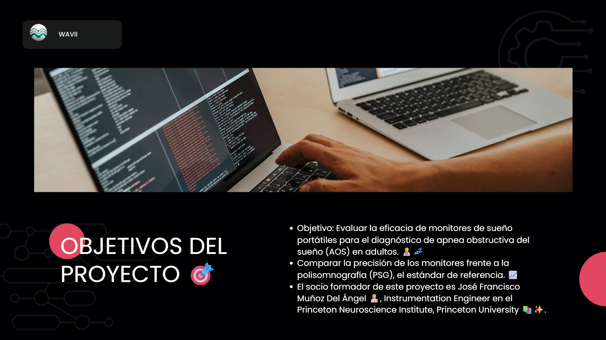
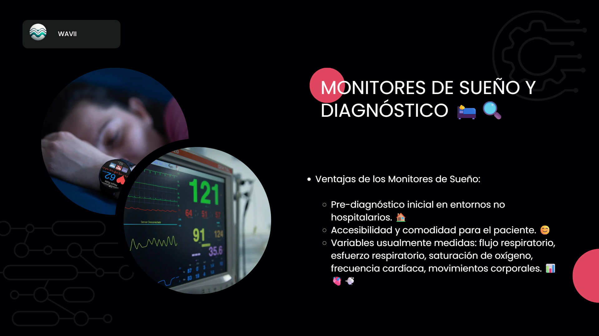
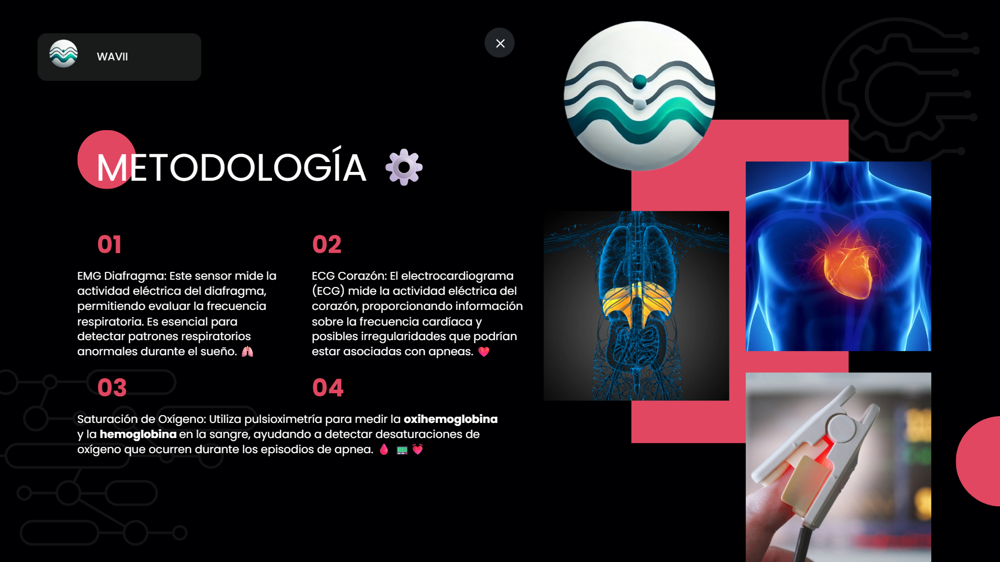
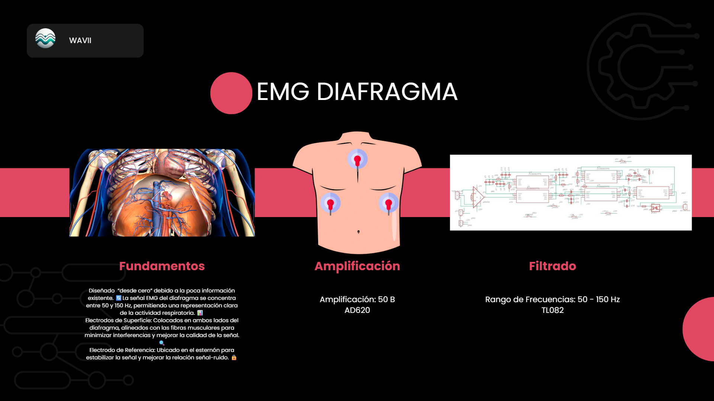
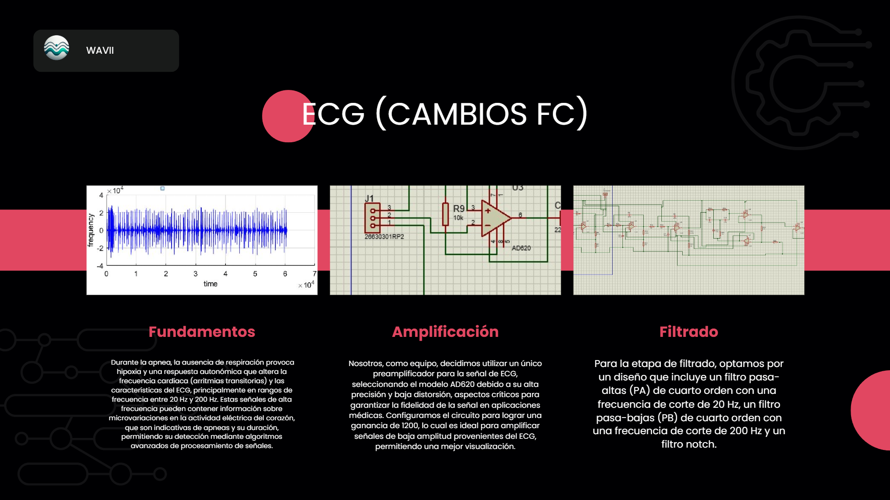
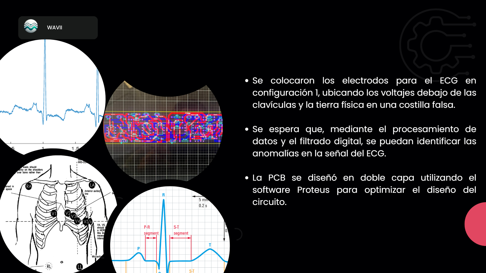
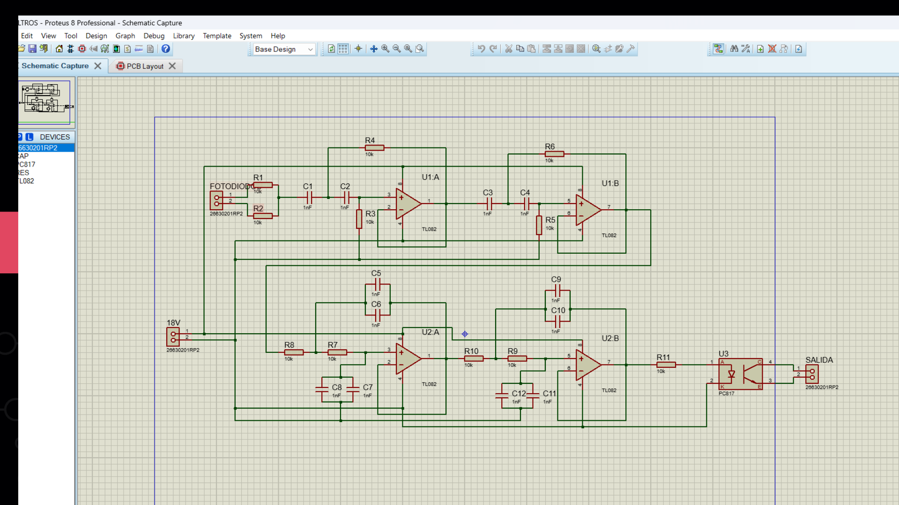
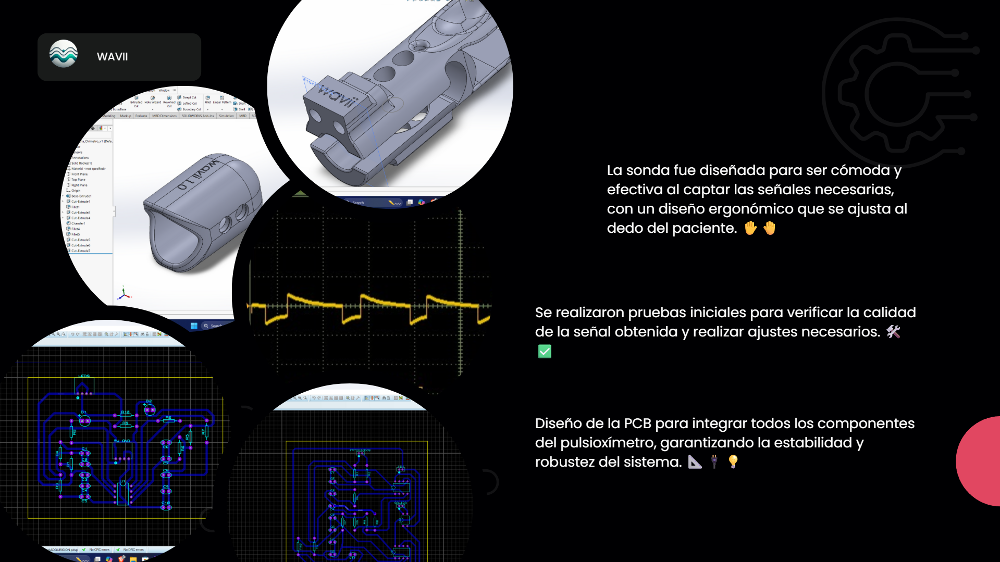
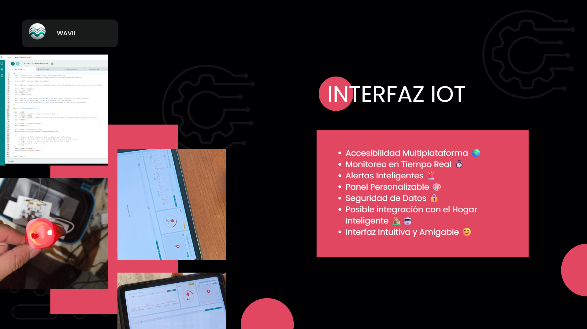
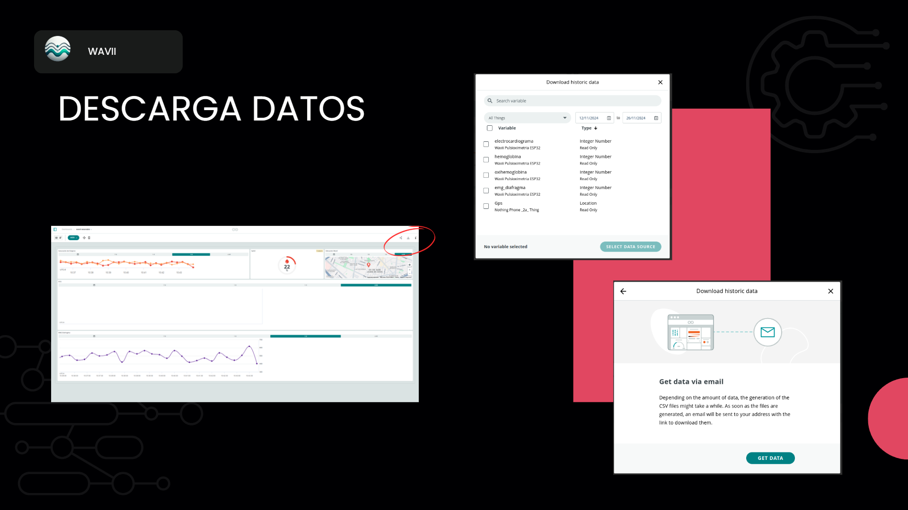
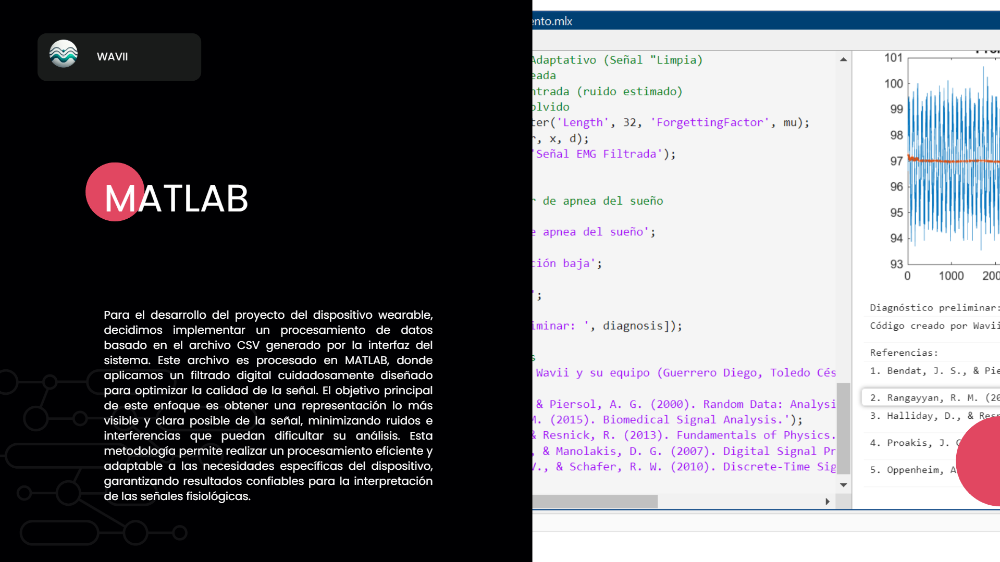

## 📜 Licencia
Copyright © 2024 Jesús Vásquez - Tecnológico de Monterrey

Este proyecto es material académico desarrollado como parte del programa educativo 
del Tecnológico de Monterrey. Se permite su uso para fines educativos y de investigación, siempre que se cite 
adecuadamente la fuente académica y se respeten los derechos de autor de las 
imágenes utilizadas en el proyecto.
